# 🏥 Well Meadows Hospital Management System

ระบบจัดการโรงพยาบาล ที่พัฒนาด้วย **VB.NET** และ **SQL Server** เพื่อช่วยในการดูแลผู้ป่วย การจัดเก็บเวชระเบียน และการจัดการข้อมูลทั่วไปของโรงพยาบาล

---

## ✨ ฟีเจอร์หลัก

### 👨‍⚕️ การจัดการผู้ป่วย (Patient Management)
- **ลงทะเบียนผู้ป่วยใหม่** - บันทึกข้อมูลส่วนตัว ประวัติทางการแพทย์
- **ค้นหาผู้ป่วย** - ค้นหาจากชื่อ รหัสผู้ป่วย หรือหมายเลขเอกสารประจำตัว
- **แก้ไขข้อมูล** - อัพเดทข้อมูลผู้ป่วยที่มีอยู่

### 📋 เวชระเบียน (Medical Record)
- **บันทึกการรักษา** - บันทึกการตรวจ การวินิจฉัย แนวทางการรักษา
- **ประวัติการรักษา** - ดูประวัติการรักษาของผู้ป่วยแต่ละคน
- **ยาที่ได้รับ** - บันทึกรายละเอียดยาที่ใช้ในการรักษา

### 📅 นัดหมาย (Appointment)
- **จัดนัดหมายใหม่** - กำหนดนัดหมายสำหรับผู้ป่วย
- **ดูปฏิทินนัดหมาย** - แสดงรายการนัดหมายในแต่ละวัน
- **แจ้งเตือน** - ส่งการแจ้งเตือนนัดหมายที่จะมาถึง

### 👥 การจัดการเจ้าหน้าที่ (Staff Management)
- **บันทึกเจ้าหน้าที่** - เพิ่มข้อมูลแพทย์ พยาบาล พยาบาลผู้ช่วย
- **จัดการข้อมูล** - แก้ไขข้อมูลเจ้าหน้าที่

### 📊 รายงาน (Reports)
- **รายงานผู้ป่วยทั้งหมด** - สรุปข้อมูลผู้ป่วยในโรงพยาบาล
- **รายงานการมารับการรักษา** - สถิติการรักษา ตามเดือน/ปี
- **รายงานยา** - รายการยาที่ใช้จ่ายไปแล้ว

---

## 🏗️ เทคโนโลยี

| ส่วนประกอบ | เทคโนโลยี |
|----------|----------|
| **Frontend** | VB.NET (Winforms) |
| **Backend** | SQL Server / SQL Server Express |
| **IDE** | Visual Studio |
| **Architecture** | 3-Tier Architecture |

---

## 📊 แผนผังระบบ

### ER Diagram (Entity Relationship Diagram)
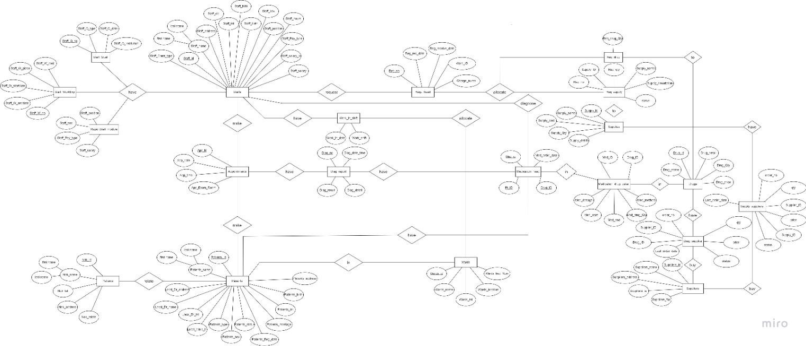

แสดงความสัมพันธ์ระหว่างตาราง เช่น 1 ผู้ป่วย สามารถมีเวชระเบียนได้หลายฉบับ

### System Flowchart
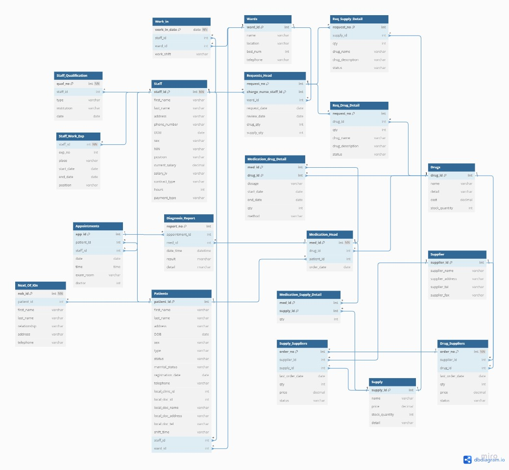

ขั้นตอนการไหลเวียนของข้อมูล และการทำงานของระบบตั้งแต่เข้าสู่ระบบ จนถึงออกรายงาน

---

## 📱 UI Screenshots (ตัวอย่างหน้าจอแอปพลิเคชัน)

### 👨‍⚕️ การจัดการเจ้าหน้าที่
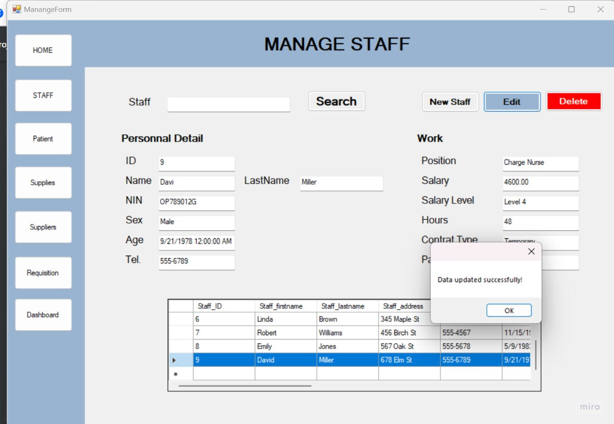

*หน้าจัดการข้อมูลเจ้าหน้าที่ (แพทย์/พยาบาล) พร้อมฟังก์ชันค้นหา แก้ไข ลบ*

### 📅 จัดนัดหมาย
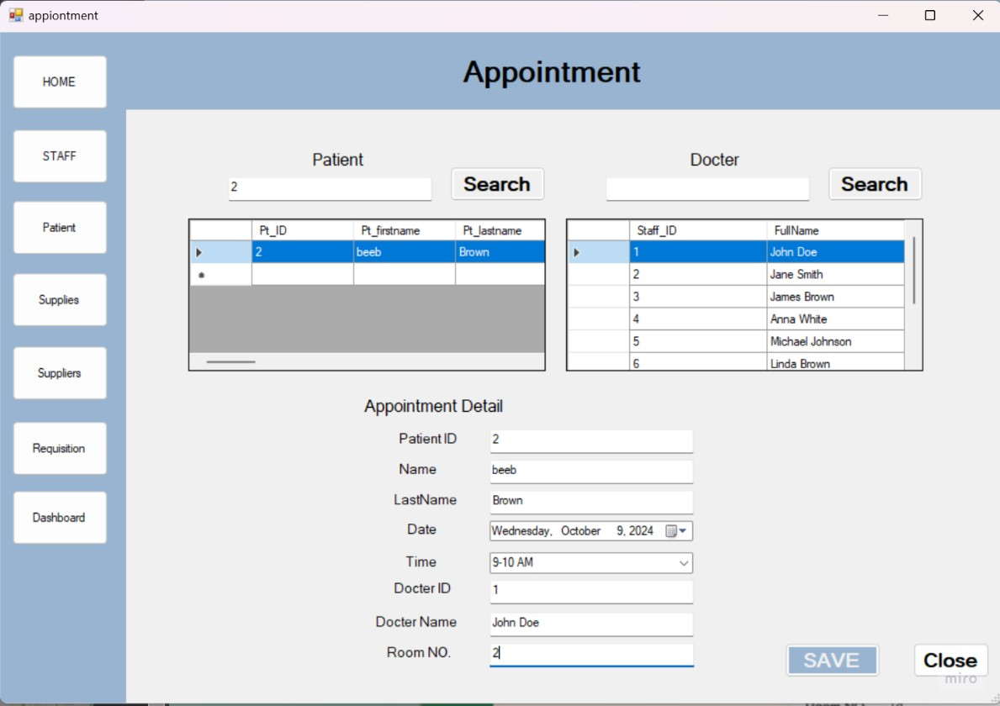

*หน้าจัดนัดหมายสำหรับผู้ป่วย เลือกแพทย์ วันเวลา และห้องรักษา*

### 👥 บันทึกญาติ/ผู้เกี่ยวข้อง
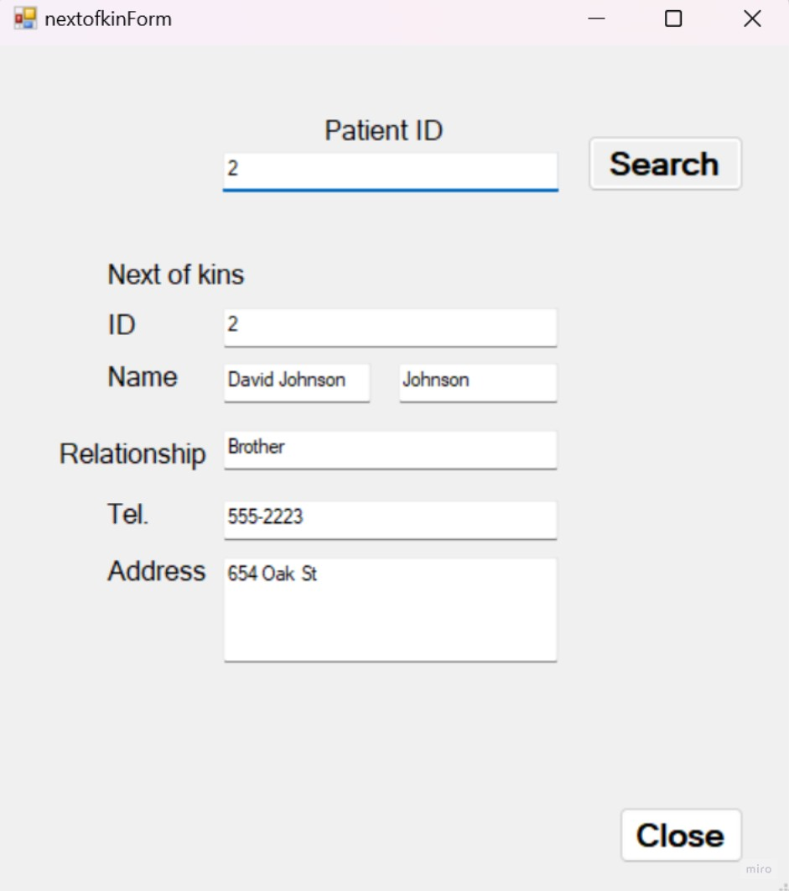

*หน้าบันทึกข้อมูลญาติหรือผู้ติดต่อของผู้ป่วย*

### 📦 จัดการยา/ชิ้นส่วน
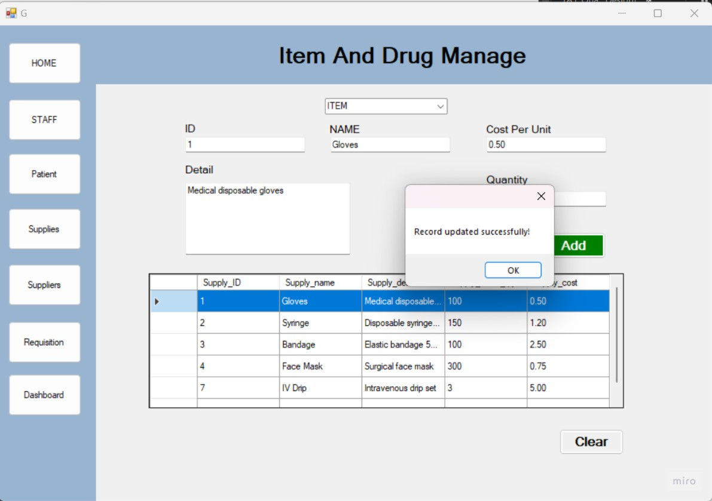

*หน้าจัดการรายการยา ชิ้นส่วน ราคา รายละเอียดสินค้า*

### 🛒 สั่งซื้อยา/ชิ้นส่วน


*หน้าสั่งซื้อยาและวัสดุแพทย์จากผู้จัดจำหน่าย เลือกสินค้า จำนวน ราคา*

### 📊 เช็คสถานะคำขอ
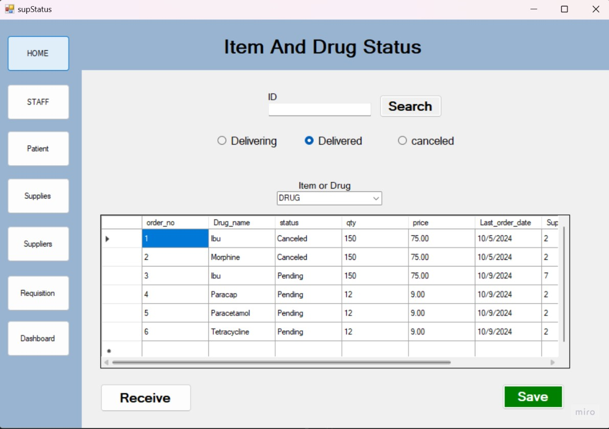

*หน้าตรวจสอบสถานะคำขอวัสดุ (รอดำเนินการ/ครบครัน/ยกเลิก)*

### 📋 ขอของ/ยา
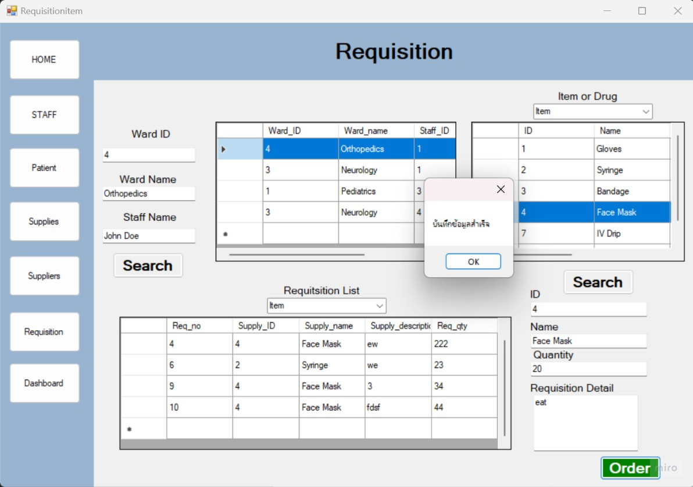

*หน้าขอวัสดุและยาจากวอร์ด/ห้องรักษา*

### 🚚 สถานะการจัดส่ง
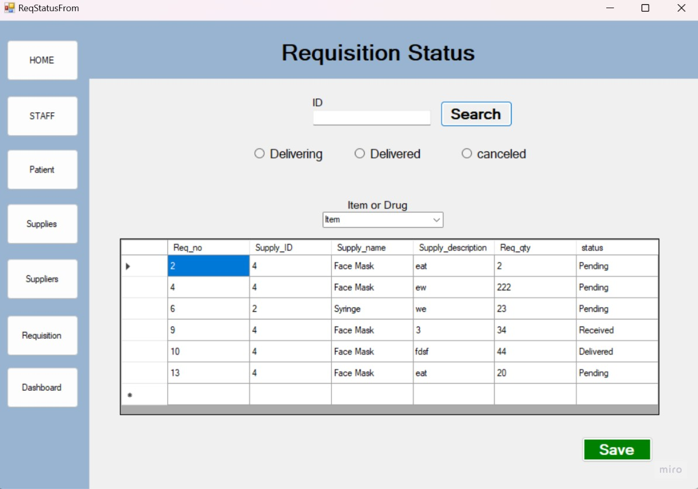

*หน้าเช็คสถานะการจัดส่งยาและวัสดุ (กำลังจัดส่ง/ส่งถึงแล้ว/ยกเลิก)*

### ✅ รับของ
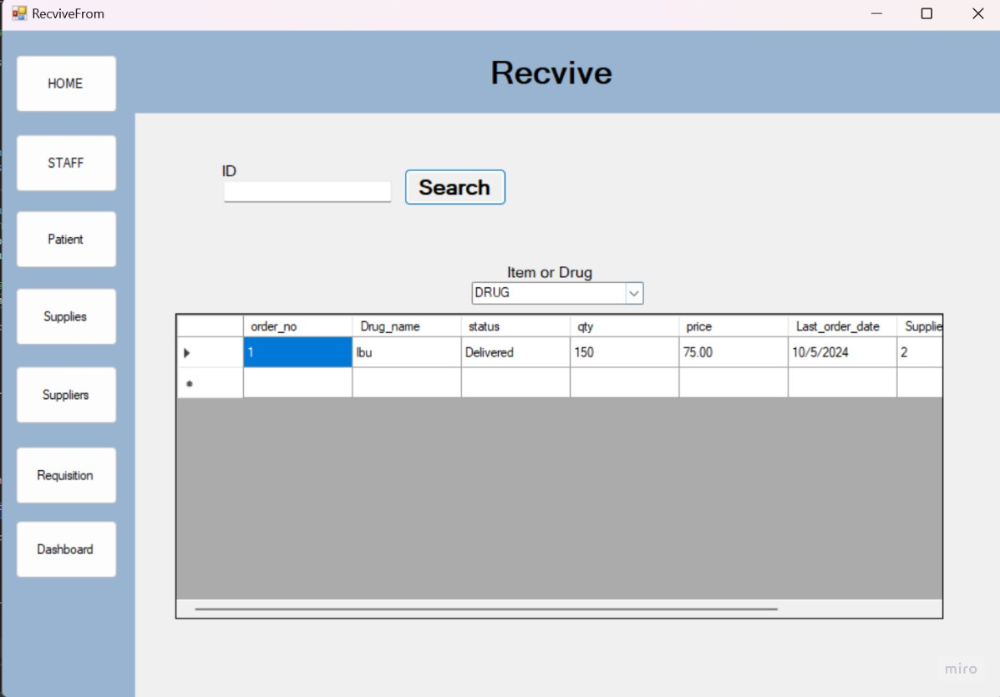

*หน้ารับชิ้นส่วน/ยา เช็คตามใบสั่ง*

### 🏢 จัดการผู้จัดจำหน่าย
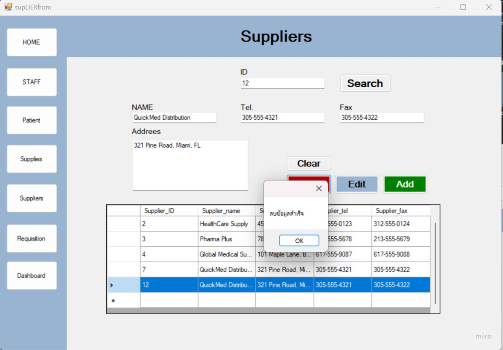

*หน้าจัดการข้อมูลผู้จัดจำหน่าย ชื่อ ที่อยู่ เบอร์โทร แฟกซ์*

---

## 📁 โครงสร้างโฟลเดอร์

```
wellhospital-management-system/
├── src/                    # Source Code (VB.NET Files)
│   ├── Wellmeadows.sln
│   └── Wellmeadows/
│
├── database/               # SQL Scripts
│   └── Wellmeadows.sql
│
├── docs/                   # เอกสารสำคัญ
│   ├── ER-Diagram.png
│   ├── System-Flowchart.png
│   └── README.md
│
└── README.md               # ไฟล์นี้
```

---


### ข้อกำหนดเบื้องต้น
- Visual Studio 2019+ (รองรับ VB.NET)
- SQL Server 2016+ หรือ SQL Server Express
- .NET Framework 4.7.2+


## 📄 License

ใช้สำหรับการศึกษาและพัฒนาเท่านั้น